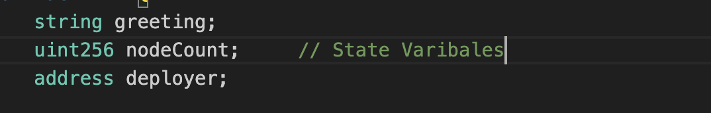

# Smart Contract Development

``` solidity
// SPDX-License-Identifier: MIT
pragma solidity ^0.8.3;                // Compiler Version

contract VPN {
    string greeting; 
    uint nodeCount;
    address deployer;                   // State Variables

    constructor() {
        deployer = msg.sender;          // Runs only during Deployment
    }

    function setGreeting(string memory greetingmsg) public {     // Function that allows to set message
        greeting = greetingmsg;                      
    }

    function getGreeting() public view returns (string memory) {    // Function that return message
        return greeting;
    }

    function setNodeCount(uint count) public {                     // Function that allows to set nodecount
        nodeCount = count;
    }

    function getNodeCount() public view returns (uint) {         // Function that returns nodecount
        return nodeCount;
    }

    function getDeployerAddress() public view returns (address) {   // Function that returns Deployer address
        return deployer;
    }
} 
``` 

---

### Constructor:
Special function that runs only once during ,during the deployment.Intializes state variable.Can't be called manually.

### Public:
Make the function accessible from every where(both inside and outside the function).

### Private;
These functions can't be accessed from outside.These functions can be accessed with in the contract only.
It means thatuser can't access these functions.

### View:
These functions can only read the blockchain data.These functions can't modify block chain data.

### Memory:
These data types are used to store data temporarily.Exists only while the function runs.

### msg.sender:
It is a global variable in solidity.It stores the address of the users whoever interacted with the contarct.

### Why do we declare variable types like string and uint256?
To tell the compiler what type of data each variable should store.

---

## State Variables:
- Variable that are stored permanently on a blockchain are called state variable.
- Stored on Ethereum Blockchain.
- State Variable values remain unchange even if we shut down our computer because they are on the block chain not on the local machine.

---



