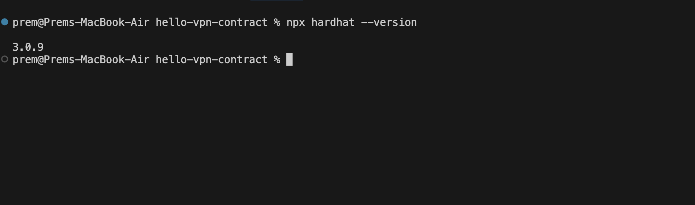
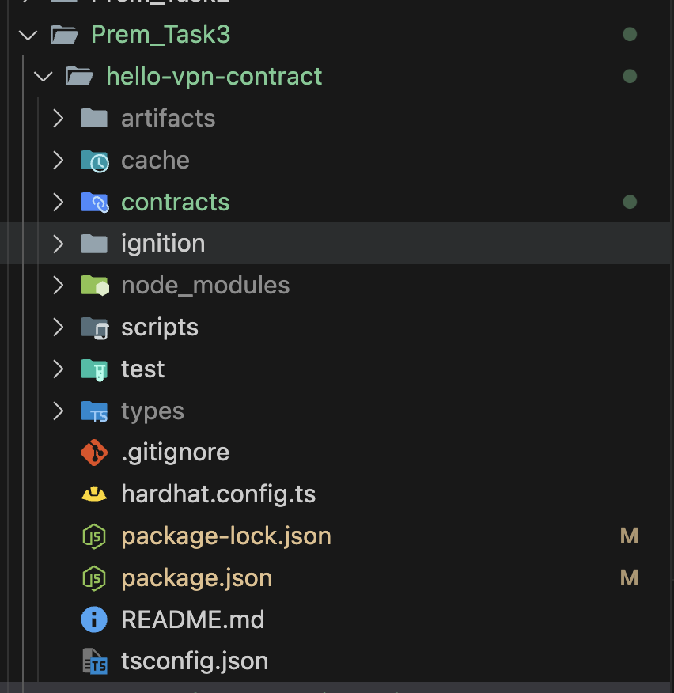
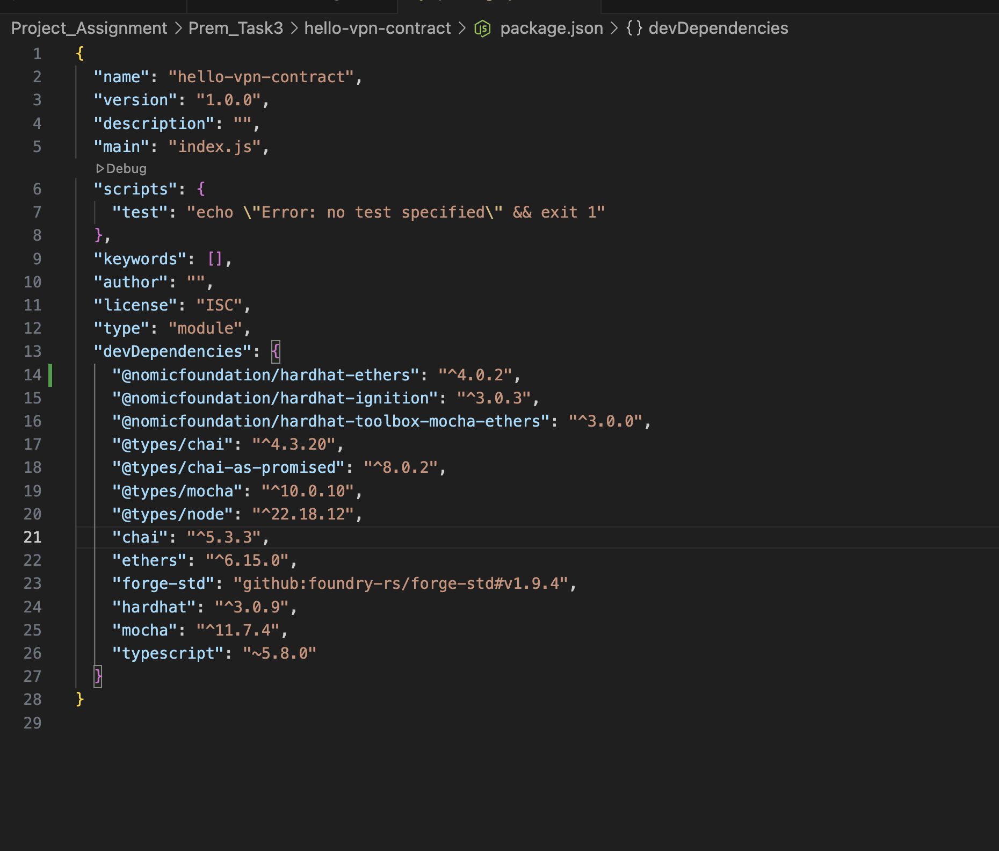

# Development Environment Setup

## 1.Environment Configuration

--

--

---
## 2.Setup

### What is Harhdat and why do we use it?
Hardhat is a developement environment for building,testing and debugging Ethereum smart contracts.We use Hardhat be cause it provides Local Ethereum Network.

---
### What files were automatically generated by Hardhat?
- contracts/
- scripts/
- tests/
- package.json
- hardhat.config.ts
- README.md

---
### Contracts:
It stores all the smart contracts.When compiled Hardhat converts these into **byte codes** and **ABI**.

### Scripts:
It contains Javascript or Typescript Deployment files.These are used to deploy the smart contracts to blockchain network.

### Tests:
It contains Javascript or Typescript Test file.These are used to test the contract on a local network.

--
### hardhat.config.ts:
It is the main configuration file in the project.It tells Hardhat how to compile,test and deploy the contarct.It contains solidity compiler version etc.

--
